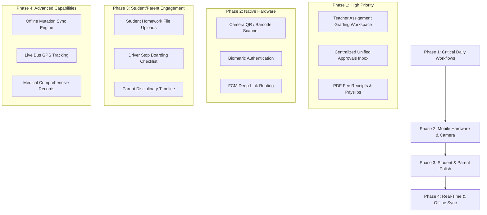

# School ERP Flutter Mobile App — Remaining Features & Implementation Audit Report

**Date:** 2026-08-19  
**Source Baseline:** [`flutter app features.md`](file:///d:/My%20own%20projects/SCHOOL%20ERP%20V2/FLUTTER%20APP/docs/flutter%20app%20features.md)  
**Target Codebase:** [`FLUTTER APP`](file:///d:/My%20own%20projects/SCHOOL%20ERP%20V2/FLUTTER%20APP) (Direct client to FastAPI backend)

---

## 1. Executive Summary

The School ERP Flutter Android application is built as a first-class mobile client communicating directly with the central FastAPI backend. The core foundation—including **RBAC authorization (`/api/v1/me`)**, **Material 3 UI design tokens**, **Riverpod state management**, **Dio HTTP interceptors**, and **role-aware navigation shells**—is established.

However, several specialized workflows, native hardware integrations (camera QR/barcode scanning, biometrics), advanced mobile features (live bus GPS tracking, offline mutation sync), and role-specific operational screens remain to be built or completed.

### Implementation Status Matrix

| Feature Area / Role | Status | Completed Capabilities | Remaining / Gaps |
| :--- | :---: | :--- | :--- |
| **Foundation & Auth** | 🟢 **90%** | Session restore, token refresh, campus switching, RBAC | Biometric unlock (`local_auth`), push notification deep-linking |
| **Student** | 🟡 **75%** | Timetable, attendance stats, results, fees, basic assignments | Homework file upload submission, syllabus tracker, admit cards |
| **Parent / Guardian** | 🟡 **70%** | Child switcher, attendance, fee payment (Razorpay), notices | Behavior/discipline log, scoped teacher messaging, boarding alerts |
| **Teacher** | 🟡 **70%** | Quick attendance toggle, draft store, marks entry, timetable | Submission grading & attachment review, past attendance corrections |
| **Admin & Principal** | 🟡 **65%** | Multi-metric dashboard, campus metrics, basic approvals | Centralized Unified Approvals Inbox, direct guardian phone/SMS action |
| **Admissions** | 🟡 **70%** | Inquiries, applications list, seat matrix, stage updates | Visual pipeline/Kanban view, interview calendar scheduling |
| **Finance / Accounts** | 🟢 **80%** | Offline payment collection, invoices, balance, discounts | Branded PDF receipt download/share, overdue aging analytics |
| **HR & Staff** | 🟡 **70%** | Staff directory, profiles, leave balance, basic payroll | Detailed payslip PDF view/export, employee document repository |
| **Library** | 🟡 **60%** | Catalog search, issues, returns, renewals, fines | **Camera barcode/ISBN scanner**, digital student ID barcode scan |
| **Transport** | 🟡 **50%** | Routes, stops, vehicles, allocations, driver info | **Driver stop checklist (Boarded/Dropped)**, live GPS map |
| **Operations & Security** | 🟡 **60%** | Visitor logs, gate pass creation, incident forms | **Camera QR scanner for gate passes**, authorized pickup verification |
| **Medical / Nurse** | 🟡 **50%** | Infirmary visit logs, basic incident reports | Full student medical history, allergy alerts, medication tracker |
| **Advanced Native** | 🔴 **25%** | Basic shared_preferences draft store, FCM device register | True offline sync queue, live GPS, camera scanning, biometrics |

---

## 2. Role-by-Role Feature Audit & Remaining Items

---

### 2.1 Student Role

#### ✅ Currently Implemented:
* **Dashboard Summary:** Student profile summary, today's schedule, attendance rate, pending fee balance, recent notices, upcoming exams.
* **Academics:** Timetable viewing, subject listing, teacher information, academic calendar.
* **Attendance:** Daily attendance status, monthly calendar breakdown, present/absent/late statistics.
* **Exams & Results:** Exam schedules, subject marks, grade breakdowns, report card list.
* **Fees:** Fee breakdown, payment history, outstanding balance, online fee payment initiation.
* **Communication & Library:** Announcements, general circulars, library borrowed books, fine balance.

#### ❌ Remaining Features to Build:
1. **Assignment File Submission:** Interactive student upload workflow for homework/assignments (picking PDFs, camera photos of completed work, and uploading to FastAPI with status tracking).
2. **Syllabus & Curriculum Tracker:** Subject-wise syllabus completion percentages and progress indicators.
3. **Admit Card Viewer & PDF Download:** Downloadable hall tickets/admit cards for upcoming term exams.
4. **Live Bus Tracking:** Map view showing real-time GPS position of the assigned school bus (when GPS is available).

---

### 2.2 Parent / Guardian Role

#### ✅ Currently Implemented:
* **Child Switcher:** Seamless switching between multiple enrolled children via top dropdown.
* **Child Dashboard:** Real-time updates of attendance, timetable, fee balance, and results for the selected child.
* **Online Fee Payment:** Integrated Razorpay checkout for fee dues.
* **Leave Requests:** Submitting leave applications on behalf of the child with date selection and reason.

#### ❌ Remaining Features to Build:
1. **Behavioral & Disciplinary Record Section:** Visible timeline of teacher remarks, merits, demerits, or disciplinary notes.
2. **Controlled Parent-Teacher Messaging:** Dedicated 1-on-1 messaging threads scoped to specific class/subject teachers (instead of broadcast notices).
3. **Real-Time Boarding & Drop-Off Alerts:** Push notifications for transport events (e.g., *"Sarah boarded Bus 07 at 7:38 AM"*).
4. **Branded Fee Receipts:** Downloadable and shareable official PDF payment receipts with school branding.

---

### 2.3 Teacher & Class Teacher Role

#### ✅ Currently Implemented:
* **Class Attendance Taking:** Fast UX with "Mark All Present", tap exceptions (Present / Absent / Late / Excused), and remarks.
* **Local Draft Storage:** Saving unsaved attendance locally to prevent data loss.
* **Marks Entry Workspace:** Entering student marks per subject/exam, max mark validation, draft submission, and finalization.
* **Timetable & Homework Creation:** Class timetable schedule and creating assignments with due dates and descriptions.

#### ❌ Remaining Features to Build:
1. **Assignment Submissions Grading Workflow:**
   * Reviewing student submissions one-by-one.
   * Downloading/viewing student attachment files.
   * Assigning marks, adding feedback remarks, marking late submissions, and returning grades.
2. **Past Attendance Correction & Audit Workflow:** Class teacher interface to request or make edits to locked past attendance records with mandatory audit reasons.
3. **Behavioral Record Entry:** Logging merits, demerits, and incident reports for students in assigned classes.

---

### 2.4 Administrator, Principal & Organization Owner

#### ✅ Currently Implemented:
* **Executive Dashboard:** Overall enrollment, student attendance %, staff attendance %, fee collection %, pending admissions count, and campus selector.
* **People Search:** Directory search for students and staff with profile details.
* **Multi-Campus Scope:** Organization owners can switch between individual campuses.

#### ❌ Remaining Features to Build:
1. **Unified Approvals Inbox:**
   * A single, centralized swipeable inbox aggregating:
     * Staff leave requests
     * Student leave requests
     * Fee concessions & discounts
     * Admission approvals
     * Purchase requisitions & facility bookings
   * Actions: **Approve**, **Reject**, **Request Clarification**, **View Full Audit Details**.
2. **One-Tap Contact Shortcuts:** Direct call, SMS, or email actions from student guardian profiles.
3. **Multi-Campus Comparative Analytics:** Side-by-side performance, revenue, and attendance analytics comparing multiple campuses.

---

### 2.5 Admissions Team

#### ✅ Currently Implemented:
* **Admissions Workspace:** Inquiries list, applications review, seat matrix overview, and status updates.

#### ❌ Remaining Features to Build:
1. **Visual Pipeline (Kanban Workflow):** Stage-by-stage dragging/updating (`Inquiry → Application → Review → Interview → Accepted → Enrolled`).
2. **Interview Scheduling & Notification:** Calendar slot picker for applicant interviews with automated parent SMS/email dispatch.

---

### 2.6 Accountant / Finance Role

#### ✅ Currently Implemented:
* **Financial Overview:** Daily and monthly collections, outstanding dues, and overdue accounts.
* **Offline Payment Recording:** Collecting fees via Cash, Cheque, Bank Transfer, or UPI with idempotency tokens.
* **Extended Workspaces:** Fee structure definitions, fee heads, discounts, and fine configuration.

#### ❌ Remaining Features to Build:
1. **PDF Receipt Generation & Sharing:** Automatic generation of official PDF receipts printable or shareable directly via WhatsApp/Email.
2. **Fee Aging & Class-Wise Defaulters Report:** Visual chart and downloadable lists of overdue fees categorized by class/aging brackets.

---

### 2.7 HR & Employee / Non-Teaching Staff

#### ✅ Currently Implemented:
* **Staff Management:** Staff directory, employee profile, leave balance, leave request creation, and attendance logs.

#### ❌ Remaining Features to Build:
1. **Detailed Payslip Viewer & PDF Export:** Salary breakdown with basic salary, HRA, allowances, deductions, PF, tax withholdings, and net pay.
2. **Staff Document Repository:** Uploading and viewing employee contracts, identity proofs, and educational credentials.

---

### 2.8 Specialized Operations

#### 📚 Librarian
* **Current:** Search books, view copies, manage reservations, record issue/return/renewals, and track fines.
* **Remaining:** **Camera Barcode / ISBN Scanner** to scan physical book barcodes and student ID cards for instant checkout/returns.

#### 🚌 Transport Manager & Bus Driver
* **Current:** Route listings, vehicle records, pickup stops, document compliance, and student allocations.
* **Remaining:**
  1. **Dedicated Driver Stop Checklist:** Driver-friendly tablet/phone view with large buttons for *"Boarded"*, *"Absent"*, and *"Dropped"* per stop.
  2. **Driver SOS / Emergency Alert:** One-tap alert broadcasting vehicle breakdown or delay notifications to parents and transport managers.
  3. **Live GPS Location Broadcaster:** Background device GPS tracking service for the driver app.

#### 🛡️ Security Guard & Receptionist
* **Current:** Visitor check-in/out, visitor logs, manual gate pass creation, and safety incident reporting.
* **Remaining:**
  1. **Camera QR Code Scanner:** Scanning student digital gate passes and visitor QR badges at school gates.
  2. **Authorized Child Pickup Verification:** Guardian photo ID verification interface before releasing a student during school hours.
  3. **Student Late-Entry Logging:** Quick scan-and-log screen for tardy arrivals.

#### 🩺 Nurse / Medical Staff
* **Current:** Basic health visit logs and medical incident records.
* **Remaining:**
  1. **Comprehensive Student Medical Profiles:** Detailed allergy records, chronic conditions, immunization/vaccine trackers, and emergency medical contacts.
  2. **Medication Administration Log:** Scheduled daily dosage tracking and parental notification for dispensary visits.

---

## 3. Cross-Cutting Technical & Mobile-Native Gaps

```
┌────────────────────────────────────────────────────────────────────────┐
│                   MISSING MOBILE-NATIVE CAPABILITIES                   │
├───────────────────┬───────────────────┬────────────────────────────────┤
│ 📷 Hardware       │ 🔄 Offline Sync   │ 🔐 Security & Push             │
│    Camera         │    Engine         │    Capabilities                │
├───────────────────┼───────────────────┼────────────────────────────────┤
│ • Barcode Scanner │ • Local mutation  │ • Biometric Unlock             │
│   (Library ISBNs) │   queue           │   (Fingerprint / Face ID)      │
│ • QR Gate Passes  │ • Background sync │ • Push notification deep-links │
│ • Student ID Card │   reconciliation  │ • PDF generation / sharing     │
│   Scanning        │ • Conflict check  │ • Live GPS tracking            │
└───────────────────┴───────────────────┴────────────────────────────────┘
```

1. **Hardware Camera Barcode / QR Scanner:**
   * Package required: `mobile_scanner`.
   * Integrations needed: Library (Book ISBN + Student ID), Security (Visitor Badge + Student Gate Pass), Transport (Boarding pass).
2. **Biometric Security:**
   * Package required: `local_auth`.
   * Integration: Quick app unlock via fingerprint or facial recognition without re-entering credentials.
3. **Offline-First Mutation Engine:**
   * Currently, drafts are stored in `SharedPreferences`. A resilient queue mechanism is needed for offline attendance submission and timetable viewing during poor connectivity.
4. **Push Notification Deep-Linking & Background Actions:**
   * Wiring FCM payload handlers in `GoRouter` so tapping an alert (e.g. *"New Assignment in Math"*) directly navigates to the assignment screen.
5. **PDF Rendering & Multi-Channel Sharing:**
   * Packages: `pdf`, `printing`.
   * Use cases: Branded fee payment receipts, term report cards, exam admit cards, and staff payslips.

---

## 4. Recommended Implementation Phases



### Phase Breakdown

* **Phase 1 (Immediate Focus):**
  * Teacher assignment submissions grading and file preview.
  * Unified Approvals Inbox on the Principal/Admin dashboard.
  * Printable/shareable PDF generation for fee receipts and payslips.
* **Phase 2 (Hardware & Security):**
  * Integrate `mobile_scanner` for library book scanning and security gate passes.
  * Integrate `local_auth` for biometric app unlock.
  * Implement push notification deep-linking.
* **Phase 3 (Role Completeness):**
  * Student assignment attachment uploads.
  * Bus driver stop checklist (`Boarded` / `Absent` / `Dropped`).
  * Medical history and allergy profiles.
* **Phase 4 (Advanced Real-Time & Offline):**
  * Robust offline sync queue for attendance.
  * Real-time GPS bus tracking and parent boarding alerts.
